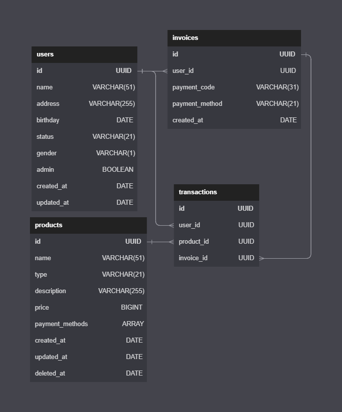
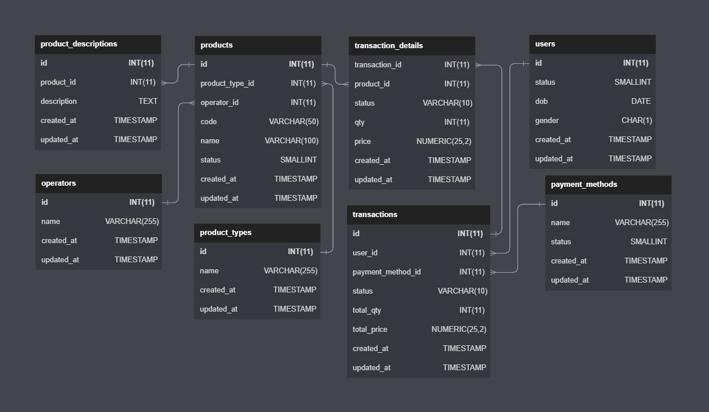

# Database, DDL, DML, DCL

-	Belajar untuk mampu mengerti bentuk-bentuk relasi skema database besar, memodelkan relasi skema dasar, mengimplementasikan 1-to 1, 1-to-many, many-to-many.

*=== Tugas ===*




*=== Tugas ===*

*One to One*, Suatu baris tabel A hanya berhubungan dengan suatu baris tabel B.
*One to Many*, Suatu baris di table A memiliki relasi di beberapa baris di table B.
*Many to Many*, Setiap lebih dari satu baris data dari tabel A berhubungan dengan lebih dari satu baris data pada tabel B.

*DDL*, Data Definition Language
*DML*, Data Manipulate Language
*DCL*, Data Control Language

*Introduction Database*
*Relationship Database*
*Entity Relationship Diagram*
*SQL Statement*

*RDMS*, Relational Database Management Systems
Software yang menggunakan *Relational Database Model* sebagai dasarnya, contoh MySQL

*DDL*, perintah untuk membuat, mengubah, dan menghapus struktur dan definisi metadata dari objek-objek database.

*DDL Statement*

```sql
CREATE DATABASE <name>;
USE <name>;
CREATE TABLE ...
DROP TABLE ...
RENAME TABLE ...
```

*DML*, perintah yang digunakan untuk memanipulasi data dalam tabel dari suatu database.

*DML Statement*

```sql
SELECT ...
INSERT ...
UPDATE ...
DELETE ...
LIKE ...
BETWEEN ...
AND ...
OR ...
ORDER BY ...
LIMIT ...
```

*AGGREGATE*

```sql
MIN
MAX
SUM
AVG
COUNT
HAVING
```

*FUNCTION*

```sql
DELIMITER $$
...
$$
```

```sql
CREATE FUNCTION sf_count_tweet_user(user_id_p INT) RETURNS INT DETERMINISTIC
BEGIN
DECLARE total INT;
SELECT COUNT(*) INTO total FROM tweets
WHERE user_id = user_id_p AND
type = 'tweets';
RETURN total;
END 
```

```sql
SELECT sf_count_tweet_user(2);
```

*TRIGGER*

```sql
CREATE TRIGGER delete_all_data_user
BEFORE DELETE ON users FOR EACH ROW
BEGIN
DECLARE v_user_id INT;
SET v_user_id = OLD.id;
DELETE FROM tweets WHERE user_id = v_user_id;
DELETE FROM user_followers WHERE user_id = v_user_id;
END
```

*DCL*, perintah SQL yang berhubungan dengan manipulasi atau pengolahan data dalam table.

```sql
GRANT ALL ...
GRANT SELECT ...
GRANT INSERT ...
GRANT UPDATE ...
GRANT DELETE ...
```

*Try it*
```sql
START TRANSACTION;
CREATE USER IF NOT EXISTS 'user'@'localhost' IDENTIFIED WITH caching_sha2_password BY 'Pass@1234' WITH MAX_USER_CONNECTIONS 1;
CREATE DATABASE IF NOT EXISTS db_user;
GRANT ALL PRIVILEGES ON db_user.* TO 'user'@'localhost';
FLUSH PRIVILEGES;
COMMIT;

-- configuration on mysql
ROLLBACK;
SET autocommit=0;

-- INNER JOIN example
SELECT products.name AS product, categories.name AS category FROM products INNER JOIN categories ON products.cate
gory_id = categories.id WHERE categories.name = 'food';
```
